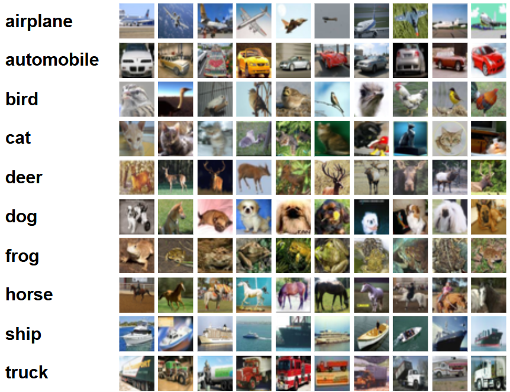
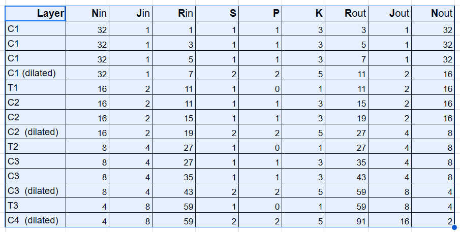

# Training CNN for CIFAR-10 dataset


Convolutional Neural Network with Depthwise Separable Convolution and Dilated Convolution


Number of images: 60,000 images  
Image size: 32x32 pixels  
Number of classes: 10  
Training images: 50,000 images  
Test images: 10,000 images  

  
The CIFAR-10 dataset is a subset of the Tiny Images dataset. The images are labeled with one of the following classes:   

airplane, automobile, bird, cat, deer, dog, frog, horse, ship, and truck.





## Summary

- Used albumentation library and apply:
    - horizontal flip
    - shiftScaleRotate
    - Cutout - coarseDropout (max_holes = 1, max_height=16px, max_width=16, min_holes = 1, min_height=16px, min_width=16px, fill_value=(mean of your dataset), mask_fill_value = None)

- Achieve 85% accuracy in less than 100 epochs with total params of 1, 50, 576.
- [Training Logs](./trainings_logs.md)
- Modularized code


## Model details

- Architecture with convolutional blocks - C1 | C2 | C3 | C4 | Output

- No MaxPooling

- Total RF Receptive Field - 91

- Used Depthwise Separable Convolution in C1 block
- Used Dilated Convolution in all the blocks
- Used GAP - Global Average Pooling 


```
----------------------------------------------------------------
        Layer (type)               Output Shape         Param #
================================================================
            Conv2d-1           [-1, 16, 32, 32]             432
       BatchNorm2d-2           [-1, 16, 32, 32]              32
              ReLU-3           [-1, 16, 32, 32]               0
           Dropout-4           [-1, 16, 32, 32]               0
            Conv2d-5           [-1, 32, 32, 32]           4,608
       BatchNorm2d-6           [-1, 32, 32, 32]              64
              ReLU-7           [-1, 32, 32, 32]               0
           Dropout-8           [-1, 32, 32, 32]               0
            Conv2d-9           [-1, 32, 32, 32]             320
           Conv2d-10           [-1, 64, 32, 32]           2,112
      BatchNorm2d-11           [-1, 64, 32, 32]             128
             ReLU-12           [-1, 64, 32, 32]               0
           Conv2d-13           [-1, 64, 16, 16]          36,864
      BatchNorm2d-14           [-1, 64, 16, 16]             128
             ReLU-15           [-1, 64, 16, 16]               0
          Dropout-16           [-1, 64, 16, 16]               0
           Conv2d-17           [-1, 16, 16, 16]           1,024
      BatchNorm2d-18           [-1, 16, 16, 16]              32
             ReLU-19           [-1, 16, 16, 16]               0
           Conv2d-20           [-1, 32, 16, 16]           4,608
      BatchNorm2d-21           [-1, 32, 16, 16]              64
             ReLU-22           [-1, 32, 16, 16]               0
          Dropout-23           [-1, 32, 16, 16]               0
           Conv2d-24           [-1, 32, 16, 16]           9,216
      BatchNorm2d-25           [-1, 32, 16, 16]              64
             ReLU-26           [-1, 32, 16, 16]               0
          Dropout-27           [-1, 32, 16, 16]               0
           Conv2d-28             [-1, 64, 8, 8]          18,432
      BatchNorm2d-29             [-1, 64, 8, 8]             128
             ReLU-30             [-1, 64, 8, 8]               0
          Dropout-31             [-1, 64, 8, 8]               0
           Conv2d-32             [-1, 16, 8, 8]           1,024
      BatchNorm2d-33             [-1, 16, 8, 8]              32
             ReLU-34             [-1, 16, 8, 8]               0
           Conv2d-35             [-1, 32, 8, 8]           4,608
      BatchNorm2d-36             [-1, 32, 8, 8]              64
             ReLU-37             [-1, 32, 8, 8]               0
          Dropout-38             [-1, 32, 8, 8]               0
           Conv2d-39             [-1, 64, 8, 8]          18,432
      BatchNorm2d-40             [-1, 64, 8, 8]             128
             ReLU-41             [-1, 64, 8, 8]               0
          Dropout-42             [-1, 64, 8, 8]               0
           Conv2d-43             [-1, 64, 4, 4]          36,864
      BatchNorm2d-44             [-1, 64, 4, 4]             128
             ReLU-45             [-1, 64, 4, 4]               0
          Dropout-46             [-1, 64, 4, 4]               0
           Conv2d-47             [-1, 16, 4, 4]           1,024
      BatchNorm2d-48             [-1, 16, 4, 4]              32
             ReLU-49             [-1, 16, 4, 4]               0
           Conv2d-50             [-1, 64, 2, 2]           9,216
      BatchNorm2d-51             [-1, 64, 2, 2]             128
             ReLU-52             [-1, 64, 2, 2]               0
AdaptiveAvgPool2d-53             [-1, 64, 1, 1]               0
           Conv2d-54             [-1, 10, 1, 1]             640
================================================================
Total params: 150,576
Trainable params: 150,576
Non-trainable params: 0
----------------------------------------------------------------
Input size (MB): 0.01
Forward/backward pass size (MB): 4.72
Params size (MB): 0.57
Estimated Total Size (MB): 5.31
----------------------------------------------------------------
```

## Requirements

```
pip install -r requirements.txt
```

## Usage

Check the model in `model.py`

To train the model, run
```
python train.py
```

## Receptive Field Calculation



Kernel size for dilated convolution can be considered as 5 X 5 for calculation (if the actual size is 3 x 3, and dilation of 2)

